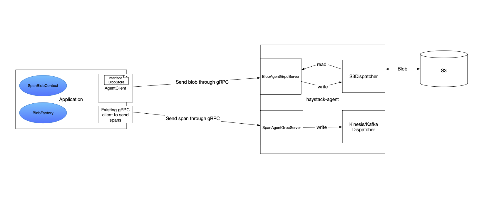
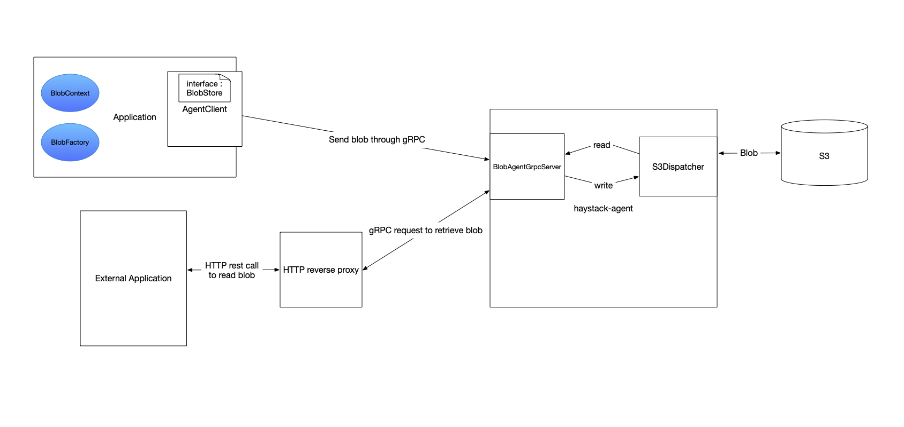

## Table Of Content
- [Haystack Blobs](#blobs-agent)
	* [Client](#client)
	* [Agent Provider/Server](#agent-provider-or-server)
	* [Dispatchers](#dispatchers)
	* [Models](#models)
	* [Span-Blob Context](#span-blob-context)
	* [Reverse Proxy](#reverse-proxy)
	* [Frequently Asked Questions(FAQs)](#faqs)

## Haystack Blobs



This module contains all the sub modules needed by an application to interact with [Haystack-Agent](https://github.com/ExpediaDotCom/haystack-agent) for dispatching a blob though a dispatcher present in it. The blob is sent to [Haystack-Agent](https://github.com/ExpediaDotCom/haystack-agent) over [GRPC](https://grpc.io/) via a client and then received by the agent via a server already running there. The blob received is then dispatched through a [dispatcher](#dispatchers) integrated in the agent.

Below is a sample configuration for blobs in [Haystack-Agent](https://github.com/ExpediaDotCom/haystack-agent):
```
agents {
  ossblobs {
    enabled = true
    port = 35001
    max.blob.size.in.kb = 1536
    dispatchers {
      s3 {
        keep.alive = true
        max.outstanding.requests = 50
        should.wait.for.upload = false
        max.connections = 50
        retry.count = 1
        bucket.name = "blobs-agent"
        region = "us-east-1"
        aws.access.key = "accessKey"
        aws.secret.key = "secretKey"
      }
    }
  }
}

```

### Client

This is a GRPC client that is used to send the blob to wherever the server resides.

The client is initiated using a builder which can either take a [ManagedChannel](https://grpc.github.io/grpc-java/javadoc/io/grpc/ManagedChannel.html) object or `address` and `port` of the server running.

The server in the haystack-agent is running at a default port 35001.

### Agent Provider or Server
We have one agent provider today that is loaded depending upon the configuration as above.

##### Blob Proto Agent
A `blob proto agent` is present to receive the blob from a GRPC client and then dispatch it to the dispatchers. This agent listens as a GRPC server on a configurable port and accepts the protobuf blob from the clients. The blob agent is already implemented in the open source repo and it supports S3 dispatcher.

### Dispatchers

##### S3 Dispatcher

S3 dispatcher uses aws s3 sdk and its TransferManager apis and we require following configuration properties for it to work.

1. region - aws region for e.g. us-west-2
2. bucket.name - aws s3 bucket name
3. aws.access.key and aws.secret.key - Optional, use them if want to use static AWS credentials.
4. max.outstanding.requests - maximum parallel uploads to s3, else RateLimitException is thrown and sent to the client
5. keep.alive - Optional, TCP keep alive for aws client. Default: `false`
6. should.wait.for.upload - Optional, define is it should wait for complete upload of blob to S3. Default: `false`		
7. max.connections - Optional,maximum connections for aws client
8. retry.count - Optional, maximum error retry for upload
9. service.endpoint - Optional, custom endpoint for s3 
10. path.style.access.enabled - Optional, can be either true or false
11. disable.chunked.encoding - Optional, can be either true or false


### Models

The blob-grpc-models is used to compile `protos` into Java files. The protos are present in a git submodule i.e. [haystack-idl](https://github.com/ExpediaDotCom/haystack-idl).

### Span-Blob Context

This module contains the `SpanBlobContext` that will be used by `BlobFactory`(inside [blobs core](blobs-core) module) to get a `BlobWriter`(inside [blobs core](blobs-core) module) for writing a blob to haystack-agent.
Whenever a blob is sent to Haystack-Agent, the key produced for that blob is saved as a tag inside the span to be used later for reading from haystack-ui.

The name of the tag can be according to the `BlobType`(inside [blobs core](blobs-core) module). There can be 2 types of tags to store a blob key inside span:
1. request-blob
2. response-blob

### Reverse Proxy



To run the HTTP proxy to GRPC service locally please follow the below steps as we have not automated everything for now. We have used [grpc-gateway](https://github.com/grpc-ecosystem/grpc-gateway) to generate the stub and proxy files.

1. Inside `reverse-proxy`, build using `go build`
2. You can add 2 optional environment variables using:

   `$ export grpc-server-endpoint=localhost:35001`
   
   `$ export http-port=:35002`
   
   	The default value of `http-port` is `:35002` and `grpc-server-endpoint` is `localhost:35001`

3. To run the server use `./main`. 

##### To generate your own stub and proxy files use the following steps:

1. Copy `blob.proto` and `blobAgent.proto` from [haystack-idl](https://github.com/ExpediaDotCom/haystack-idl) to `reverse-proxy` folder.

2. Inside `blobAgent.proto` replace
```
rpc readBlobAsString(BlobSearch) returns (FormattedBlobReadResponse);
```
with
```
rpc readBlobAsString(BlobSearch) returns (FormattedBlobReadResponse) {
       option (google.api.http) = {
            get: "/getBlob/{key}"
            response_body: "data"
        };
   }
```

Note: You need not commit this change.

2. Run the following two commands. Make sure you have go installed on you local. If not, use `brew install go`, `export PATH="$PATH:$GOPATH/bin"`(specify `$GOPATH` if not already present)
```
go get -u github.com/grpc-ecosystem/grpc-gateway/protoc-gen-grpc-gateway v1.9.4
go get -u github.com/golang/protobuf/protoc-gen-go v1.9.4
```

3. Create a folder named `blob` inside the `reverse-proxy` module, if not already present.

4. Inside `reverse-proxy`, generate gRPC stub using
```
protoc -I/usr/local/include -I. \
  -I$GOPATH/pkg/mod/github.com/grpc-ecosystem/grpc-gateway\@v1.9.4/third_party/googleapis \
  --plugin=protoc-gen-go=$GOPATH/bin/protoc-gen-go \
  --go_out=plugins=grpc:blob/. \
  ./blobAgent.proto
```

5. Inside `reverse-proxy`, generate reverse-proxy using `protoc-gen-grpc-gateway`
```
protoc -I/usr/local/include -I. \
  -I$GOPATH/pkg/mod/github.com/grpc-ecosystem/grpc-gateway\@v1.9.4/third_party/googleapis \
  --plugin=protoc-gen-grpc-gateway=$GOPATH/bin/protoc-gen-grpc-gateway  \
  --grpc-gateway_out=logtostderr=true:blob/. \
  ./blobAgent.proto
```

6. Inside `reverse-proxy`, generate `Blob` model
```
protoc -I/usr/local/include -I. \
  -I$GOPATH/pkg/mod/github.com/grpc-ecosystem/grpc-gateway\@v1.9.4/third_party/googleapis \
  --plugin=protoc-gen-go=$GOPATH/bin/protoc-gen-go \
  --go_out=plugins=grpc:blob/. \
  ./blob.proto
```

7. Inside `reverse-proxy` call `go build`

8. To run the server use `./main -http-port=:35002 -grpc-server-endpoint=localhost:35001`. 

	The command line arguments are optional with default value of `http-port` as `:35002` and `grpc-server-endpoint` as `localhost:35001`

### FAQs

1. Can I save some other type of blob apart from request and response?

	Answer: Yes you can create your own type of blob and save them like the way request and response object of a micro-service is saved in a store.

	The steps involved requires you to create your own of [BlobType](https://github.com/ExpediaDotCom/blobs/blob/master/core/src/main/java/com/expedia/blobs/core/BlobType.java) using `BlobType.from(String type)` and use this while writing the blob to the sink through [BlobWriterImpl's](https://github.com/ExpediaDotCom/blobs/blob/master/core/src/main/java/com/expedia/blobs/core/BlobWriterImpl.java) `write(BlobType blobType, ContentType contentType, Consumer<OutputStream> dataCallback, Consumer<Metadata> metadataCallback)` function.
    
    The BlobType you use for a specific piece of data/log to be stored in the sink will be stored as a tag with tag name similar to `"blob type"-blob` for a particular span in haystack, where `blob type` is the `type` you used to create BlobType. 
    
    Example: The request blob with BlobType as `request` is saved with a tag for a particular span using tag name as `request-blob`.
