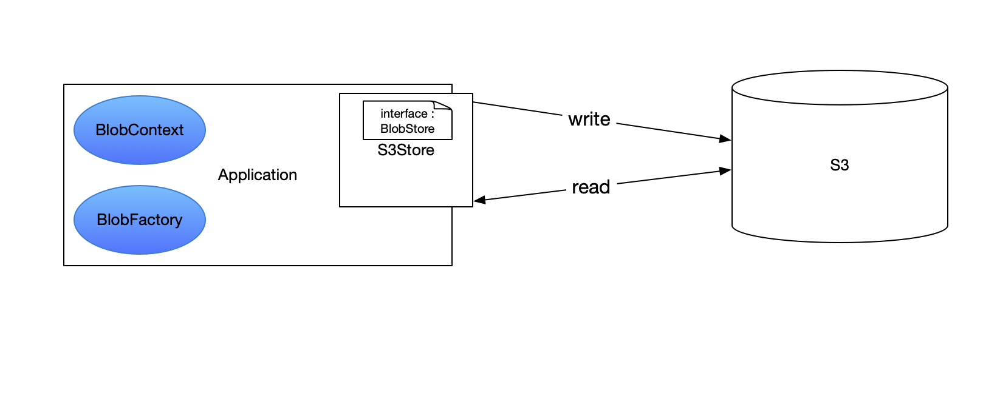

## Stores

The stores are the sinks that can directly be integrated with a micro-service to dump a blob to a defined location.

There are two types of stores that come out of the box:
- [File Store](#file-store)
- [S3 Store](#s3-store)

You can contribute in development of many more stores.

#### File Store

This store is used to dump a blob to a local directory of a system where the micro-service is running.

#### S3 Store

This store will dump a blob to a given S3 bucket directly without using Haystack-Agent's dispatcher.

##### One can use these Stores to retrieve the blobs whenever needed.

